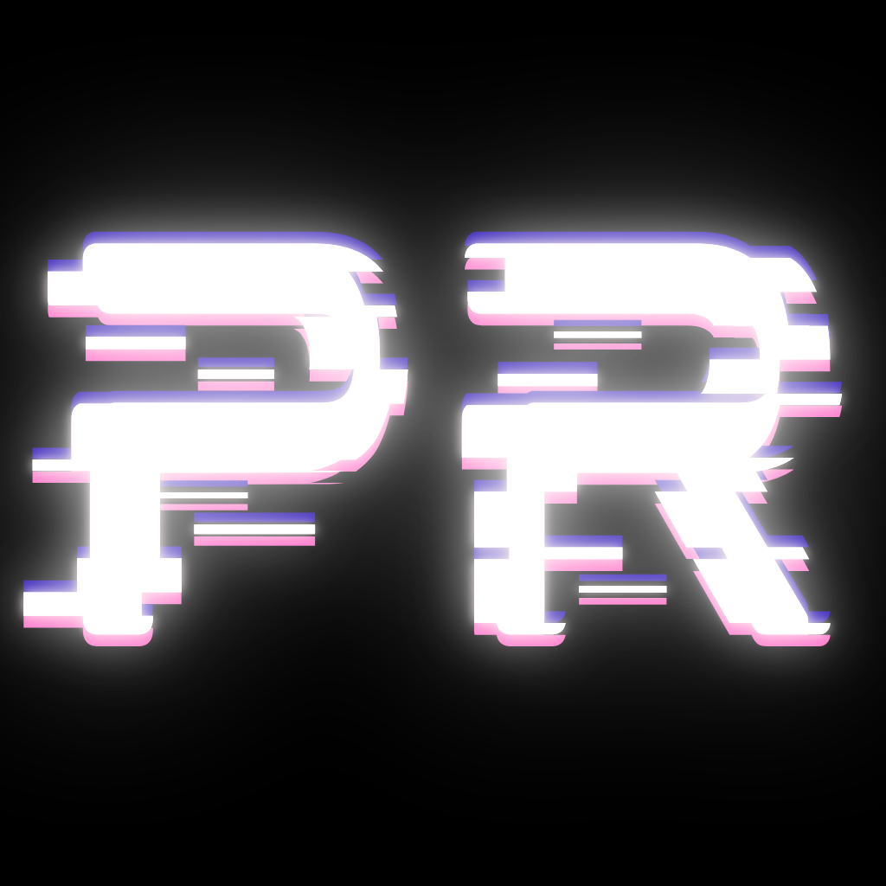
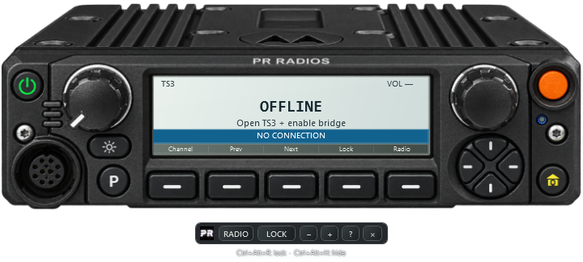
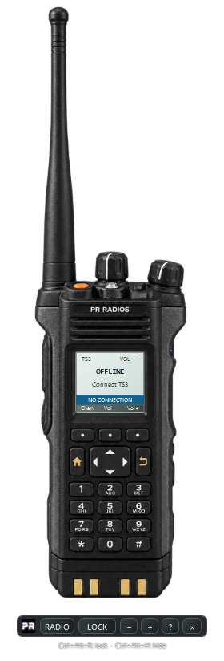

<p align="center"></p>

# PR Radios

**A realistic radio overlay for TeamSpeak 3 on Windows.**

Switch between a handheld radio and a mobile radio while playing. PR Radios displays your TeamSpeak channel, who is speaking, and transmit/receive status, with clickable channel and volume controls.



## Download

Go to [Releases](https://github.com/ChiefUmoney/PR-Radios/releases) and download **PR-Radios-v0.2.0-win64.zip** from the **v0.2.0** pre-release.

Choose that ZIP under **Assets**, rather than GitHub's automatically generated source-code ZIP. It includes the app and TeamSpeak bridge installer; no compilation is required to use it.

## Setup

1. Extract the ZIP into a folder you can write to.
2. Close TeamSpeak 3, then open **PR-Radios-Bridge.ts3_plugin** to install the bridge.
3. Reopen TeamSpeak. Enable **PR Radios Bridge** under **Tools → Options → Addons** and join your server.
4. Run **PR-Radios.exe**.
5. Set your push-to-talk key in TeamSpeak's Capture settings.
6. Open your game in windowed or borderless mode and position the radio. Press **Ctrl+Alt+R** to enable click-through mode.

Requires **64-bit Windows**, the **.NET Framework 4.x WPF runtime**, and **64-bit TeamSpeak 3 with plugin API 26**. The prototype targets Windows 11 with TS3 3.6.2. TeamSpeak 6 is not supported. Everyone communicating must join a shared TeamSpeak server.

See [the complete setup guide](START-HERE.md) for installation, controls, and troubleshooting.

## Controls

| Control | Action |
| --- | --- |
| Ctrl+Alt+R | Lock/unlock click-through mode |
| Ctrl+Alt+H | Show/hide the overlay |
| Ctrl+Alt+S | Switch radio model |
| Left knob, mouse wheel | Adjust TeamSpeak volume |
| Right knob, mouse wheel | Change channel |
| Click right knob / first key below screen | Open channel menu |
| Direction pad left/right | Previous/next channel |
| Direction pad up/down | Volume up/down |
| Handheld keys 1–9 | Select a channel from the list |
| Toolbar − / + | Resize |
| System tray icon | Show, unlock, switch model, or exit |

Drag the mobile top casing or handheld speaker grille to reposition it. The toolbar disappears in click-through mode, leaving the radio visible.

<details>
<summary>Handheld preview</summary>



</details>

## What is included

- Two realistic radio skins and the PR logo.
- Transparent always-on-top overlay with movable and resizable layouts.
- Live channel, speaker, transmit/receive indicators, and volume controls.
- Native TeamSpeak 3 bridge using a local connection restricted to the current Windows account.
- Source for the desktop app and bridge, artwork, and a build script.

## Prototype status

**v0.2.0 is a pre-release.** Builds, visual inspection, bridge simulations, control routing, and desktop smoke checks passed. Live TeamSpeak voice and ERLC gameplay still need end-to-end testing.

The app uses TeamSpeak's native push-to-talk. It does not modify Roblox or connect to ERLC's built-in radio. Scanning, zones, radio audio effects, and automatic vehicle/team detection are not implemented. Exclusive fullscreen is not a supported target. Channel changes still obey TeamSpeak permissions; password-protected channels should be joined in TeamSpeak.

The binaries are unsigned. The overlay reports version 0.2.0; the unchanged bridge reports 0.1.0.

## Build from source

Install Visual Studio 2022 Build Tools with the **Desktop development with C++** workload and a Windows SDK. Use **Windows PowerShell** and the Windows .NET Framework compiler/runtime.

From the repository folder, run:

```powershell
.\Build.ps1
```

The build produces `PR-Radios.exe`, `PR-Radios-Bridge.ts3_plugin`, and `plugin/pr_radios_bridge.dll`. Required artwork and API 26 headers are included. Build outputs and local preferences are ignored by Git.

To regenerate the Windows icon after changing `assets/logo.png`, run `source/Make-Icon.ps1` before building.

## Project files

| Path | Purpose |
| --- | --- |
| `source/Radio.cs` | WPF overlay and controls |
| `source/bridge.cpp` | TeamSpeak 3 bridge |
| `source/sdk/` | TeamSpeak plugin SDK headers |
| `assets/` | Radio skins, PR logo, and icon |
| `docs/` | Actual app previews |
| `START-HERE.md` | User setup guide |

SDK headers originate from the [official TeamSpeak plugin SDK](https://github.com/teamspeak/ts3client-pluginsdk); provenance is recorded in `source/SDK-SOURCE.txt`. [Artwork notes](assets/ARTWORK.md) describe the generated housings. This is an independent project, not an official TeamSpeak, Motorola, Roblox, or ERLC product.
